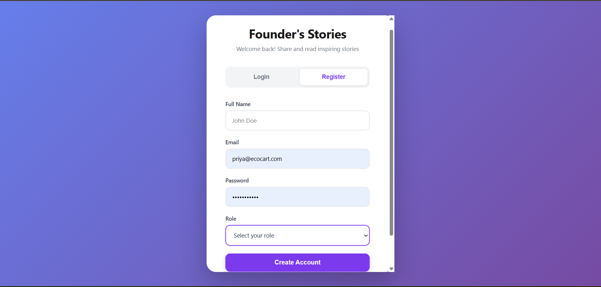
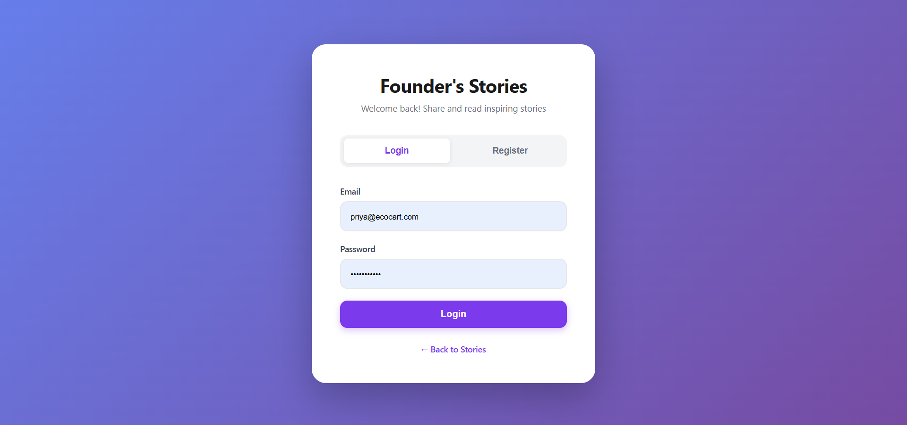
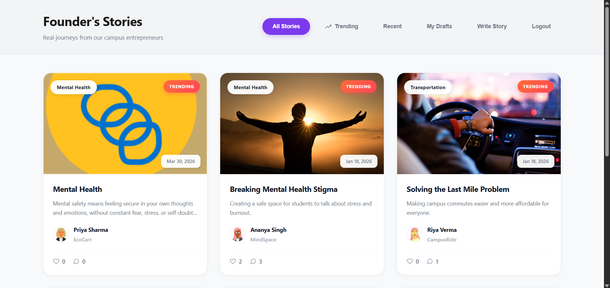
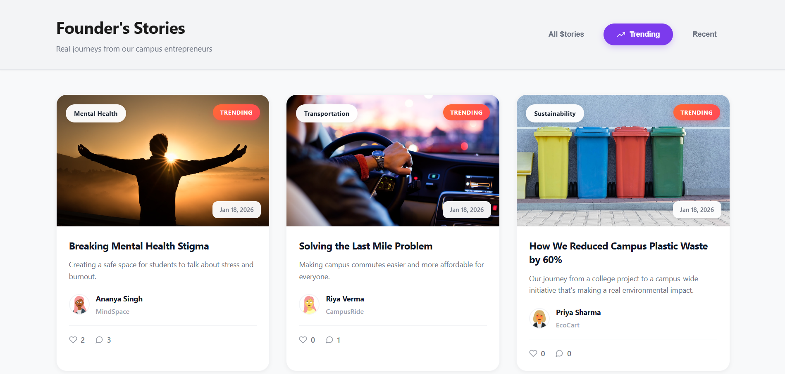
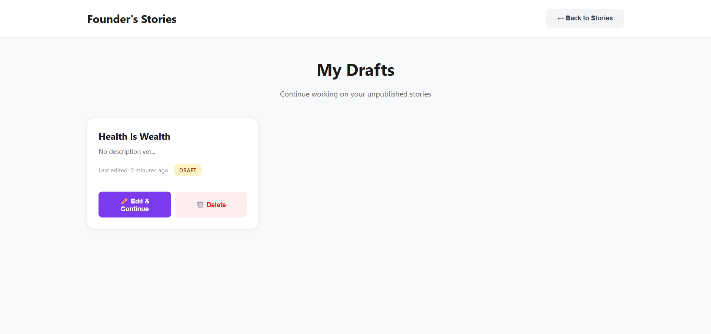
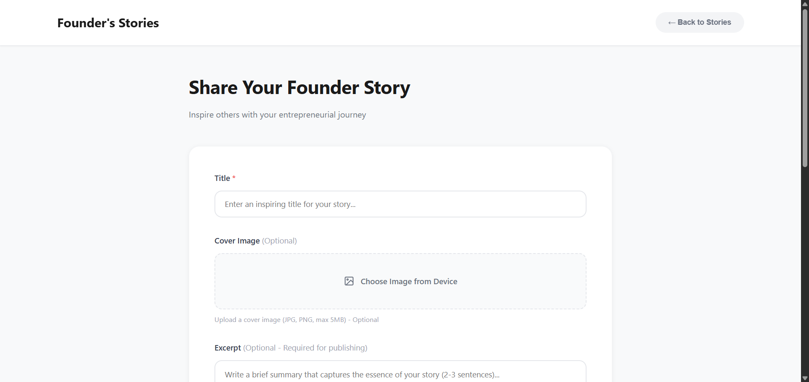
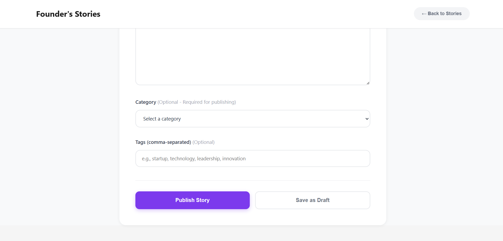

# 🚀 Founder's Stories

## 📌 Overview

Founder Stories is a full-stack web platform that connects **college startup founders** with **students**.
It enables founders to share their journey through blogs while students can explore, engage, and learn from real experiences within their campus ecosystem.
**Built to simulate a real-world content platform with role-based access and moderation.**

---

## 🎯 Problem Statement

Students often lack direct exposure to real startup journeys within their college.
This platform bridges that gap by creating a **centralized space for founders and learners to interact**.

---

## ✨ Key Features

### 👤 Authentication

* Secure login system
* Role-based access (Admin / Founder / Student)

### 📝 Founder Dashboard

* Create, edit, and delete blogs
* Save drafts before publishing
* Manage all posts in one place

### 📖 Student Experience

* Read full blog posts
* Like and comment on blogs
* Discover startup stories within college

### 🔥 Smart Feed

* **Trending Section** → based on engagement (likes, comments, views)
* **Recent Section** → latest blogs first

### 🛡️ Admin Controls

* Moderate content
* Manage users and posts

---

## 🛠 Tech Stack

**Frontend:**

* HTML
* CSS
* JavaScript

**Backend:**

* Node.js
* Express.js

**Database:**

* MongoDB

---

## ⚙️ How It Works

1. User logs in
2. Lands on Home Page
3. Sees:

   * 🔥 Trending blogs
   * 🆕 Recent blogs
4. Can read, like, and comment
5. Founders can manage their content
6. Admin ensures platform quality

---

## 🧠 Core Logic

* Trending blogs are calculated using engagement metrics (likes, comments, views)
* Recent blogs are sorted by timestamp
* Role-based authorization ensures secure access

---

## 📂 Project Structure (Basic)

```
frontend/
backend/
```

---

## 🚀 Getting Started

### 1. Clone the repository

```bash
git clone https://github.com/neetuyadav23/Founder-Stories.git
```

### 2. Install dependencies

```bash
npm install
```

### 3. Setup environment variables

Create a `.env` file and add:
```
MONGO_URI=your_mongodb_uri
JWT_SECRET=your_secret_key
```

### 4. Run the project

```bash
npm run dev
```

---

## 📸 Screenshots 

### 📝 Register Page  


### 🔐 Login Page  


### 🏠 Home Page  


### 🔥 Trending Section  


### 📝 Drafts  


### ✍️ Write Blog (Step 1)  


### ✍️ Write Blog (Step 2)  


---

## 🔮 Future Improvements

* Follow/Subscribe to founders
* Bookmark blogs
* Notifications system
* Advanced analytics for trending

---

## 🤝 Contributing

Contributions are welcome! Feel free to fork and improve.

---

## 📬 Contact

If you have any suggestions or feedback, feel free to reach out.
Mail: neetuwork888@gmail.com

---

⭐ If you like this project, don’t forget to star the repo!
